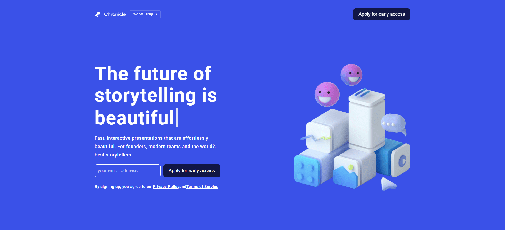
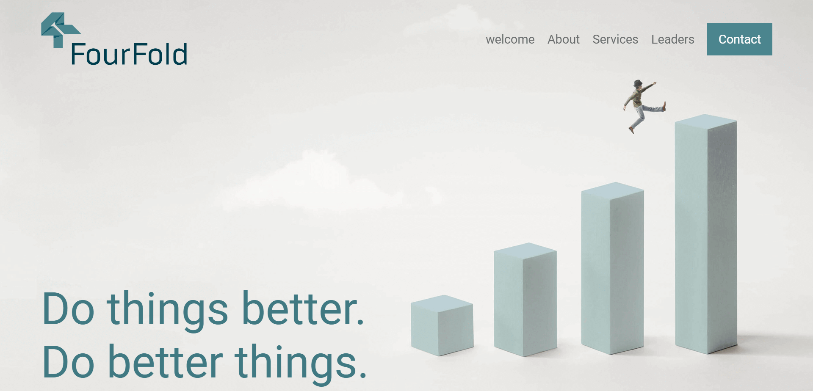
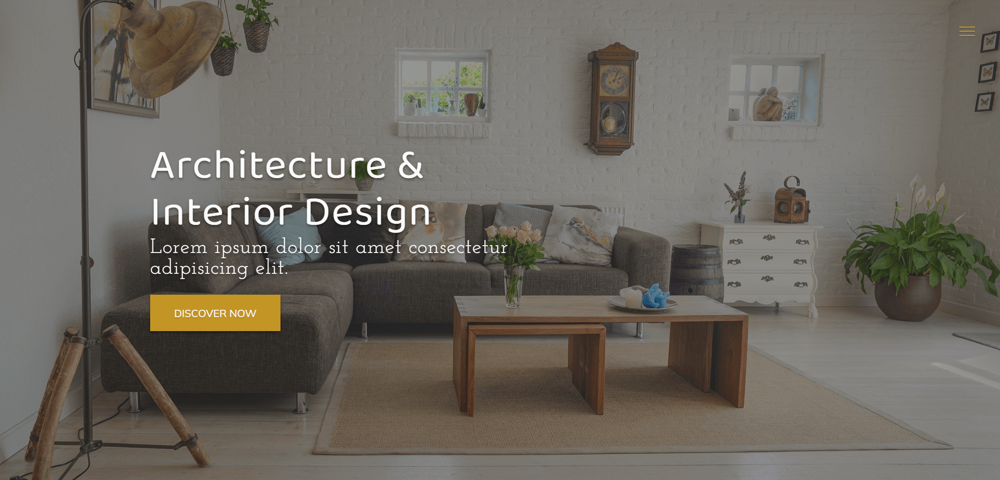

# Portfolio websites (Front-End)

This repo showcases websites (Front-End) as a portfolio of mine.
(You should note that these websites are just samples to prove my basic knowledge and my skills and experience are much more than these)

## Websites (Front-End) Links

- [Startup website with Sass and Vanilla JS](https://github.com/MH-Alikhani/portfolio-websites-frontend/tree/startup-website)

  
   
   

- [Consulting website with Vanilla JS](https://github.com/MH-Alikhani/portfolio-websites-frontend/tree/consulting-website)

  
   
   

- [Architect website with Vanilla JS](https://github.com/MH-Alikhani/portfolio-websites-frontend/tree/architect-website)

  
