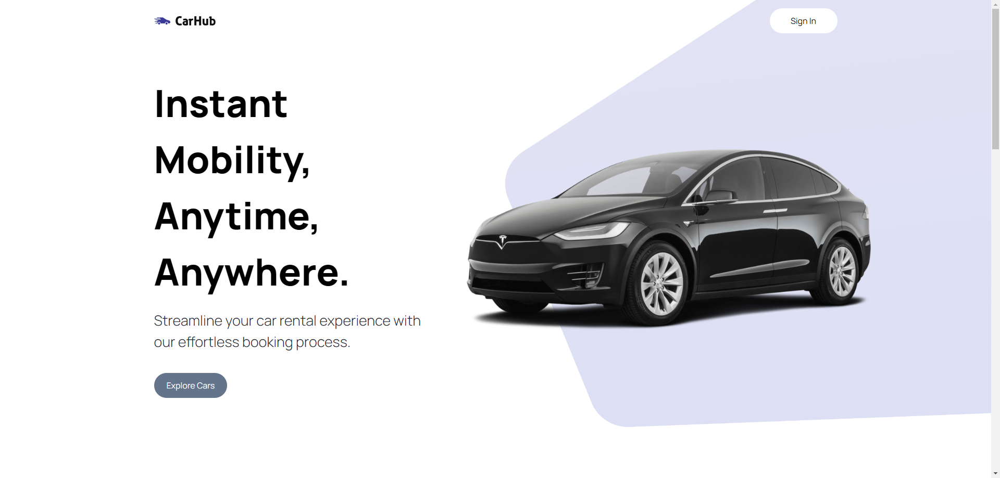

# Front-End Portfolio: Showcasing My Web Development Expertise

Welcome to my portfolio repository, where I present a collection of front-end projects that demonstrate my abilities in modern web development. These samples reflect my foundational knowledge, but my skills and expertise go far beyond what’s shown here.

## A Journey Through My Front-End Projects

Every website in this portfolio tells a story of growth, creativity, and technical prowess. Each one is crafted with a unique combination of cutting-edge technologies and approaches to meet specific goals, from sleek user interfaces to seamless user experiences. Here’s a closer look at some of the featured projects:

### [CarHub Website: Built with Next.js, TypeScript, and Tailwind CSS](https://github.com/MH-Alikhani/portfolio-websites-frontend/tree/carhub-website)

Explore the CarHub website, developed using Next.js for fast, scalable web applications, TypeScript for type-safe code, and Tailwind CSS for flexible and responsive styling. This project showcases my ability to build high-performance, modern web applications with cutting-edge tools.

---

### [Startup Website: Crafted with Sass and Vanilla JavaScript](https://github.com/MH-Alikhani/portfolio-websites-frontend/tree/startup-website)

This sleek and minimalist startup website is built using Sass for advanced styling capabilities and Vanilla JavaScript for dynamic interactions. It highlights my proficiency in creating clean, efficient, and maintainable front-end code without relying on heavy frameworks.

---

### [Consulting Website: Developed with Vanilla JavaScript](https://github.com/MH-Alikhani/portfolio-websites-frontend/tree/consulting-website)

For this consulting firm’s website, I relied on Vanilla JavaScript to create a lightweight, fast, and responsive design. The project emphasizes my ability to build straightforward yet effective solutions that offer seamless user experiences.

---

### [Architect Website: Built with Vanilla JavaScript](https://github.com/MH-Alikhani/portfolio-websites-frontend/tree/architect-website)

This architecture-focused website features clean lines and a minimalist aesthetic, powered by Vanilla JavaScript. It showcases my ability to create visually appealing, user-friendly sites that effectively communicate a brand’s essence.

---

Each of these projects highlights my adaptability and commitment to delivering front-end solutions that combine technical expertise with creative design. While these projects are just a glimpse of my capabilities, they represent the breadth of my skills and dedication to excellence in web development.
